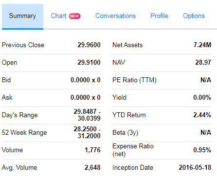

```{r setup, include=FALSE}
knitr::opts_chunk$set(echo = FALSE, 
                      error = FALSE, 
                      message = FALSE, 
                      results = "asis",
                      fig.path = "img",
                      fig.align = "center",
                      fig.path="img/")

```

Something wrong with my python [yahoo finance](https://pypi.python.org/pypi/yahoo-finance/1.1.4) API so tried `R`.

**Goal** 

Scrape the *Yahoo Finance* summary page of a list of commission-free exchange-traded funds (ETFs) described in [here](https://www.tdameritrade.com/retail-en_us/resources/pdf/TDA1000835.pdf) using the ticker symbol it provided.



**Data** 

The ticker symbols are extracted from the pdf already: `new funds.csv`

**Web Scraping** 

Used `XML` library.

Use the first symbol as example: `s = symbol[1]`

```{r echo=TRUE, message=FALSE, error=FALSE}
library(XML)
library(dplyr)
library(knitr)
library(kableExtra)

  s = "FAAR"
  url = paste("https://finance.yahoo.com/quote/", s, "?p=", s, sep = "")
  webpage = readLines(url)
  html = htmlTreeParse(webpage, useInternalNodes = TRUE, asText = TRUE)
  smr = rbind(assign(s, readHTMLTable(getNodeSet(html, "//table")[[2]])), 
              assign(s, readHTMLTable(getNodeSet(html, "//table")[[3]]))) %>% t()
  colnames(smr) = c(smr[1,])
  rownames(smr) = c("", s)
  smr = as.data.frame(smr)[2,]

kable(t(smr))
```

**Data Cleaning and Transformation**

Data are saved as `chr`. Used `dplyr` and `tidyr` library to clean and transform.

```{r}
load("data/final summary.RData")
kable(t(final.summary[1:5,]))
```