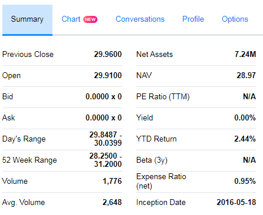

Web Scraping Yahoo Finance without API
================

Something wrong with my python [yahoo finance](https://pypi.python.org/pypi/yahoo-finance/1.1.4) API so tried `R`.

### Goal

Scrape the *Yahoo Finance* summary page of a list of commission-free exchange-traded funds (ETFs) described in [here](https://www.tdameritrade.com/retail-en_us/resources/pdf/TDA1000835.pdf) using the ticker symbol it provided.



### Data

The ticker symbols are extracted from the pdf already: `new funds.csv`

### Web Scraping

Used `XML` library.

Use the first symbol as example: `s = symbol[1]`

``` r
library(XML)
library(dplyr)
library(knitr)
library(kableExtra)

  s = "FAAR"
  url = paste("https://finance.yahoo.com/quote/", s, "?p=", s, sep = "")
  webpage = readLines(url)
```

    ## Warning in readLines(url): incomplete final line found on 'https://
    ## finance.yahoo.com/quote/FAAR?p=FAAR'

``` r
  html = htmlTreeParse(webpage, useInternalNodes = TRUE, asText = TRUE)
  smr = rbind(assign(s, readHTMLTable(getNodeSet(html, "//table")[[2]])), 
              assign(s, readHTMLTable(getNodeSet(html, "//table")[[3]]))) %>% t()
  colnames(smr) = c(smr[1,])
  rownames(smr) = c("", s)
  smr = as.data.frame(smr)[2,]

kable(t(smr))
```

|                     | FAAR              |
|---------------------|:------------------|
| Previous Close      | 29.9600           |
| Open                | 29.9100           |
| Bid                 | 0.0000 x 0        |
| Ask                 | 0.0000 x 0        |
| Day's Range         | 29.8487 - 30.0399 |
| 52 Week Range       | 28.2500 - 31.2000 |
| Volume              | 1,776             |
| Avg. Volume         | 2,648             |
| Net Assets          | 7.24M             |
| NAV                 | 28.97             |
| PE Ratio (TTM)      | N/A               |
| Yield               | 0.00%             |
| YTD Return          | 2.44%             |
| Beta (3y)           | N/A               |
| Expense Ratio (net) | 0.95%             |
| Inception Date      | 2016-05-18        |

### Data Cleaning and Transformation

Data saved as `chr` need to be transform into `num`.

Missing value needs to be replaced.

Used `dplyr` and `tidyr` library.

|      |  Previous Close|     Open|  Bid Price|  Bid Size|  Ask Price|  Ask Size|  Day's Low|  Day's High|  52 Week Low|  52 Week High|  Volume|  Avg. Volume|  Net Assets|    NAV|  PE Ratio (TTM)|   Yield|  YTD Return|  Beta (3y)|  Expense Ratio (net)| Inception Date |
|------|---------------:|--------:|----------:|---------:|----------:|---------:|----------:|-----------:|------------:|-------------:|-------:|------------:|-----------:|------:|---------------:|-------:|-----------:|----------:|--------------------:|:---------------|
| FAAR |         29.9600|  29.9100|      29.84|      1000|      30.01|       500|    29.8500|     30.0000|       28.250|         31.20|    1485|         2648|     7240000|  28.97|              NA|  0.0000|      0.0244|         NA|               0.0095| 2016-05-18     |
| FPA  |         35.3600|  35.1900|      35.14|       500|      35.36|       200|    35.1900|     35.3400|       26.990|         35.36|     439|        12490|    48660000|  33.56|              NA|  0.0226|      0.2536|       0.91|               0.0080| 2011-04-18     |
| FBZ  |         15.6900|  15.4700|      15.34|      1400|      15.39|      1300|    15.2000|     15.4800|       12.570|         18.24|    5083|        13339|    13320000|  16.65|              NA|  0.0709|      0.3034|       1.67|               0.0080| 2011-04-18     |
| FCAN |         25.2614|  25.1900|      25.42|       500|      25.44|      1500|    25.1900|     25.3324|       22.060|         25.87|     152|          754|     7590000|  25.28|              NA|  0.0109|      0.1026|       1.15|               0.0080| 2012-02-14     |
| FCEF |         21.9400|  21.9699|      21.87|       300|      21.97|       100|    21.9381|     21.9699|       18.946|         23.93|    1592|         6367|    32070000|  22.04|              NA|  0.0505|      0.1415|       0.00|               0.0000| 2016-09-27     |
| FNI  |         39.0000|  39.1400|      39.05|       100|      39.08|      1100|    38.9790|     39.1150|       27.280|         39.83|    4974|        29676|   339310000|  38.34|              NA|  0.0098|      0.4107|       1.22|               0.0060| 2007-05-08     |
| SKYY |         44.0500|  44.1000|      43.98|       200|      44.01|       500|    43.8900|     44.1000|       33.340|         44.13|   29048|       133042|  1090000000|  41.88|              NA|  0.0033|      0.2185|       1.13|               0.0060| 2011-07-06     |
| FXD  |         38.3900|  38.3800|      38.38|      1600|      38.40|       800|    38.3204|     38.4405|       33.430|         39.05|   18230|        94556|   388310000|  38.45|              NA|  0.0092|      0.0903|       0.76|               0.0061| 2007-05-08     |
| FXG  |         45.1500|  45.0900|      45.00|      4100|      45.02|       700|    45.0100|     45.1900|       43.480|         47.82|  139009|        55487|   411190000|  45.69|              NA|  0.0127|      0.0077|       0.53|               0.0061| 2007-05-08     |
| FV   |         27.0300|  27.0100|      27.05|     50800|      27.09|     54000|    26.9500|     27.0900|       21.740|         27.20|  112068|       230195|  2400000000|  26.17|              NA|  0.0075|      0.1340|       0.99|               0.0030| 2014-03-05     |

...

*Scraped data shown above might not be consistent because they are scraped in different time.*
