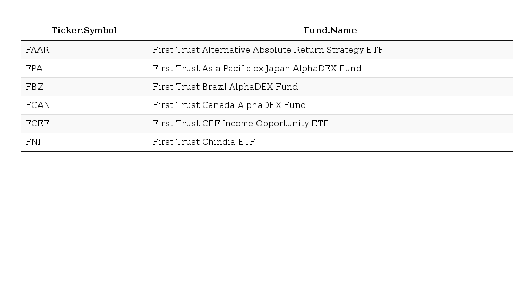

Web Scraping Yahoo Finance without API
================

Something wrong with my python [yahoo finance](https://pypi.python.org/pypi/yahoo-finance/1.1.4) API so tried `R`.

**Goal** Scrape the *Yahoo Finance* summary page of a list of commission-free exchange-traded funds (ETFs) described in [here](https://www.tdameritrade.com/retail-en_us/resources/pdf/TDA1000835.pdf) using the ticker symbol it provided.

**Data** The ticker symbols are extracted from the pdf already:

